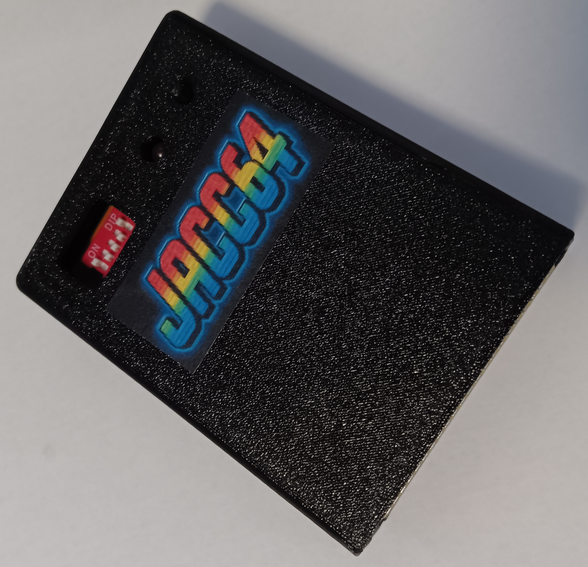
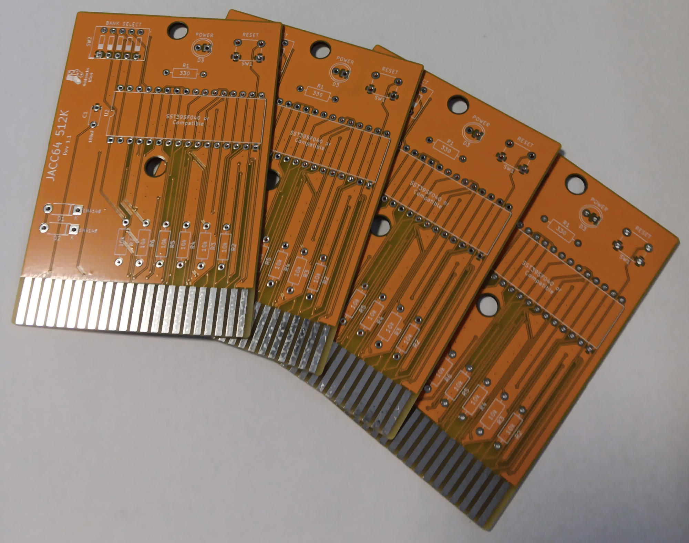

# JACC64-512K

## Description
JACC64-512K: Just Another Commodore Cartridge.

A cartridge for the Commodore 64 that holds 32 selectable 16K ROM images

**Additional Features**
* Power LED
* Reset Switch

## Bill of Materials

| Qty | Component                              |
|:---:|----------------------------------------|
| 1   | 5mm LED                                |
| 1   | 6mm Tactile Push Button                |
| 1   | 330Ω Axial Resistor - ¼ watt (LED)     |
| 6   | 10KΩ Axial Resistors - ¼ watt          |
| 2   | 1N4148 Diodes                          |
| 1   | 100nF Ceramic Capacitor                |
| 1   | 5-pole DIP Switch                      |
| 1   | SST39SF040 EEPROM (or compatible)      |

* IC sockets optional
* The LED resistor is nominally 330Ω but anything up to 1K is fine
* You will need to join 32 x 16K ROM images together into a single image before burning to the EEPROM
* Smaller EEPROMs could be used, but will obviously hold fewer images and the DIP switch should be set accordingly

## 3D Printable Case
A 3D printable case specifically designed for this PCB is also available. STLs are included in this repo and there is also a [Thingiverse Page](https://www.thingiverse.com/thing:7089362)

* Designed to use screws as they produce a much nicer, more robust case
* 2 x 3.5mm self-tapping screws to attach the shells. Max length about 15mm

## Support Me
* [My Projects](https://projects.amiga-hardware.com) - Donate on this page
* [Order the JACC64-512K PCB](https://www.pcbway.com/project/shareproject/JACC64_512K_32_Game_C64_Cartridge_42f2de5b.html)
* [Order the JACC64-512K Case](https://www.pcbway.com/project/shareproject/JACC64_512K_C64_Cartridge_Case_49b9f140.html)
